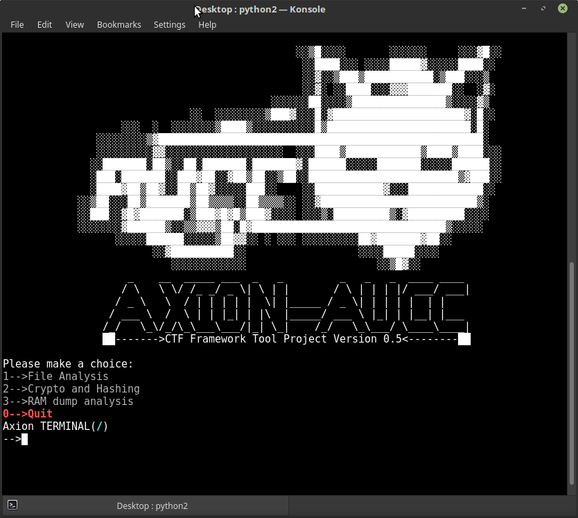
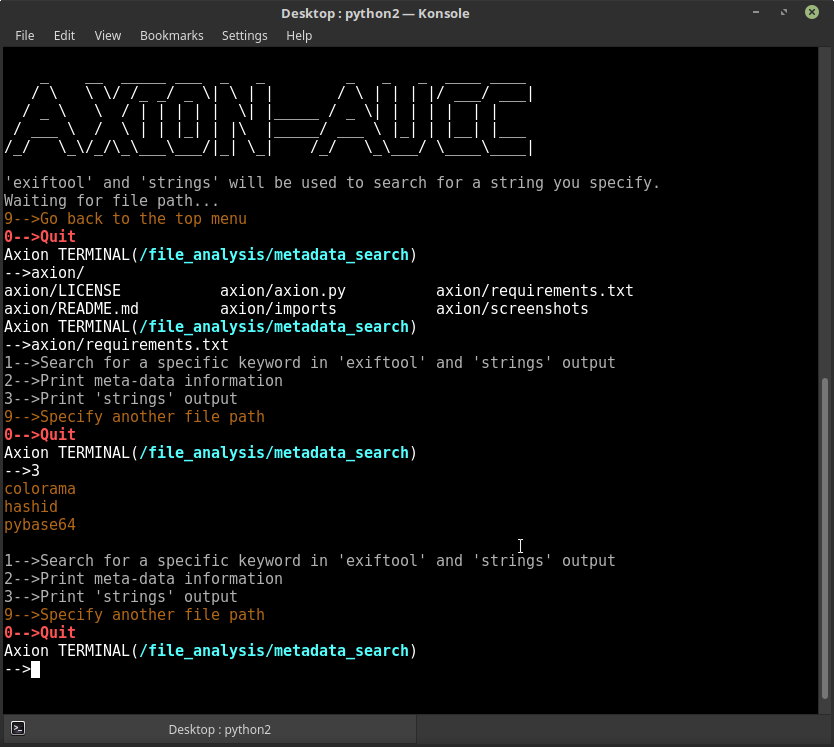
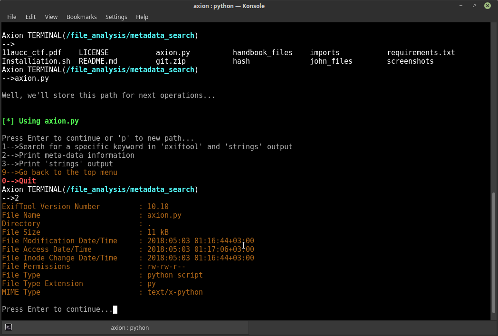

</img> 


A simple toolkit that contains little tools and capable to control the I/Os of some useful tools to make it easier yout life in CTFs. 

## :exclamation: Requirements

Fully supported distros are :arrow_heading_down:
* [Kali](https://www.kali.org/)

Supported distros are :arrow_heading_down:
* [Ubuntu](https://www.ubuntu.com/)
* [Mint](https://linuxmint.com/)
* [Debian](https://www.debian.org/)

Supported python versions are 2.7.X

## ⚙ Installation

Open the terminal and type the following command :arrow_heading_down:
```bash 
  bash <(curl https://raw.githubusercontent.com/AUCyberClub/axion/master/Installiation.sh)
```

## :video_game: Usage

Open the terminal and type the following command :arrow_heading_down:

```bash
  python2 axion.py
```

For detailed usage manual :arrow_right: [click here!](https://github.com/AUCyberClub/axion/wiki)

## :camera: Screenshots

</img> 
</img> 
</img>

## ✌️ [Authors](https://github.com/AUCyberClub/axion/graphs/contributors)

## :question: Questions and Contributing

If you have any questions, ideas or whatsoever, please create new issues.


