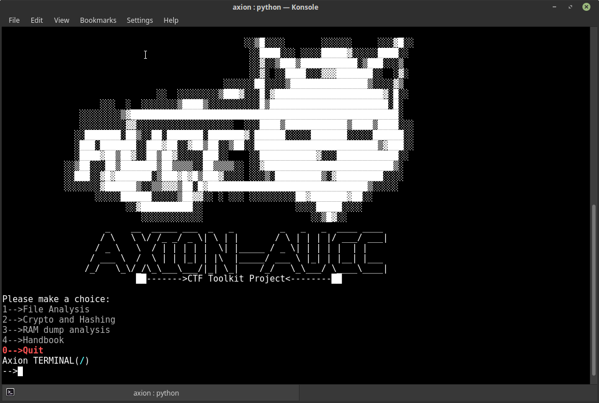
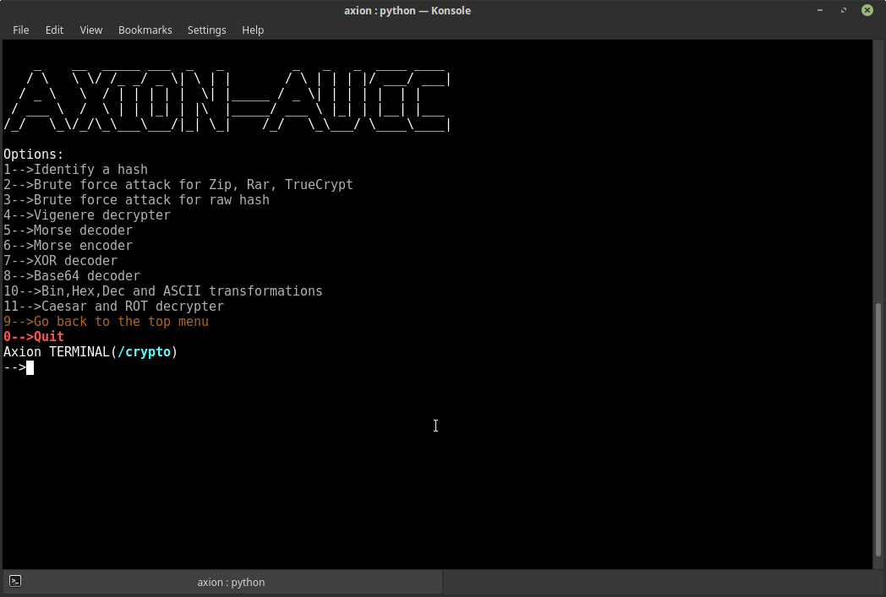

</img> 


A simple toolkit that contains useful tools and capable of control the I/Os of those tools to make it easier your life in CTFs.

## :exclamation: Requirements

Supported distros are :arrow_heading_down:
* [Kali](https://www.kali.org/)
* [Ubuntu](https://www.ubuntu.com/)
* [Mint](https://linuxmint.com/)
* [Debian](https://www.debian.org/)

Supported python versions are 2.7.X

## ⚙ Installation

Open the terminal and type the following command :arrow_heading_down:
```bash 
  bash <(curl https://raw.githubusercontent.com/AUCyberClub/axion/master/Installiation.sh)
```

For manuel installation :arrow_right: [click here!](https://github.com/AUCyberClub/axion/wiki/(ENG)-Installiation)

## :video_game: Usage

* If you installed with script, open the terminal and type the following command :arrow_heading_down:

```bash
  axion
```
* If you installed manually, open the terminal and type the following command :arrow_heading_down:

```bash
  python2 axion.py
```

For detailed usage manual :arrow_right: [click here!](https://github.com/AUCyberClub/axion/wiki)

## :camera: Screenshots

</img> 
</img> 
</img>

## ✌️ [Authors](https://github.com/AUCyberClub/axion/graphs/contributors)

## :question: Questions and Contributing

If you have any questions, ideas or whatsoever, please create new issues or send pull requests.


