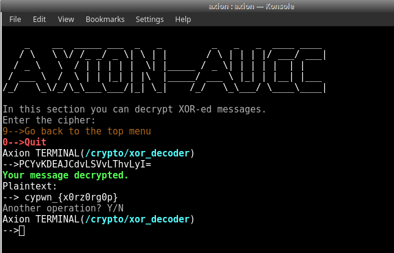
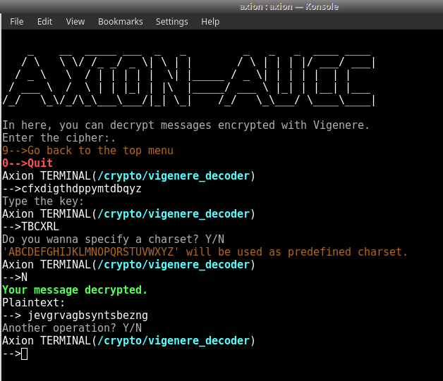
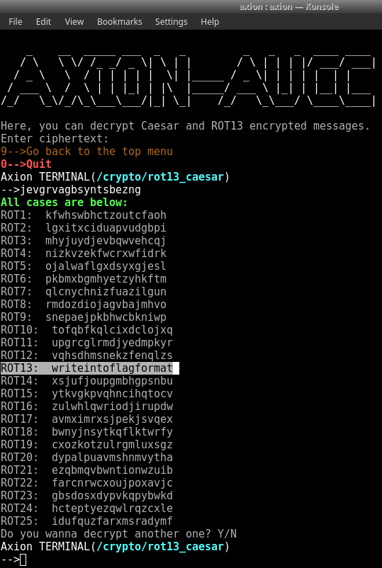
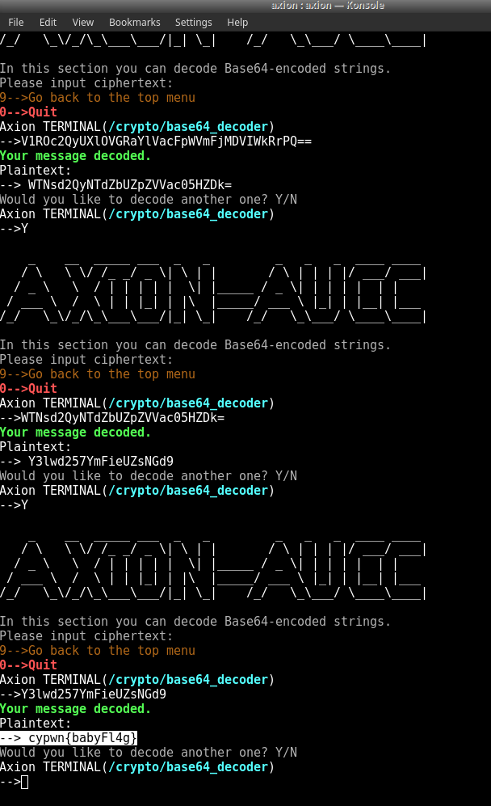
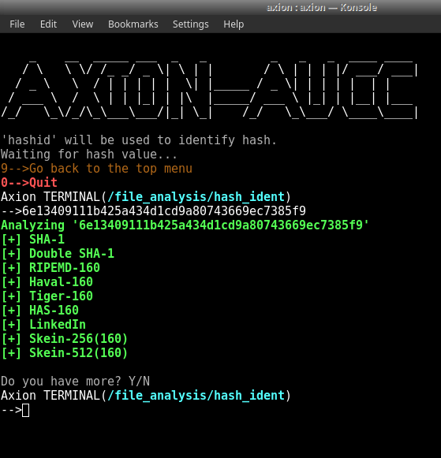
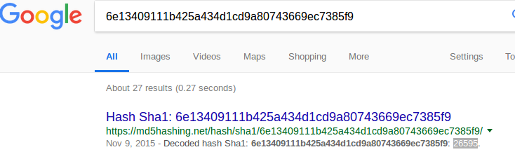
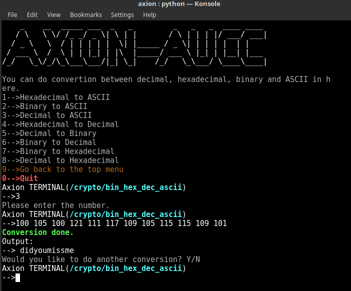

# AXION REHBER BOLUM 2

##Cryptography Nedir?

### Giriş

En basit tanımıyla var olan bir verinin, okunabilirliğini kısıtlamak amacıyla kullanılan algoritmalar bütünüdür. Verinin okunabilirliğini kısıtlayarak veri güvenliğini sağlar.

Genelde veriyi bozmadan verinin formu değiştirilir. Böylece hem veri güvenliği sağlanır hem de veri kaybı yaşanmaz.

### CTF'ler ile alakası ne?

CTF'lerde kendine ait geniş bir kategoriye sahiptir ve *Crypto* soruları olarak geçer. Bu sorularda amacımız genelde formu değiştirilmiş verileri okunabilir formlarına geri çevirerek *FLAG'i* elde etmektir. 4 küçük alt kategoriye ayrılır.

#### Encoding

*Encoding'in* amacı verinin formunu kayıpsız bir şekilde başka bir forma çevirmektir. Kendini *Encrypt'den* farkı bu işlemi yaparken **key (anahtar)** kullanmamasıdır. *Encode* eyleminin tersi *Decode'dur* ve *Decode* işlemi için gereken tek şey *Encode* için kullanılan algoritmanın bilinmesidir herhangi özel bir anahtar ya da şifreye ihtiyaç yoktur.

En çok karşılaşılan türleri:

* Base64
* Unicode
* ASCII
* Taban Dönüşümleri

#### Encrypting

*Encoding* ile aynı amaca sahiptir ancak *Encrypt* işleminde özel bir **key (anahtar)** kullanılır. Bu sayede *Decrypt* işlemi için algoritma ile beraber bu özel anahtarın bilinmesi gereklidir. Özel anahtar olmadan şifreyi çözmenin tek yöntemi *Brute Force (Kaba Kuvvet)* saldırısı yapmaktır basitçe mümkün olduğunca her kelimeyi anahtar olarak denemektir :D

Alt türleri olarak açık anahtarlı şifreleme ve gizli anahtarlı şifreleme adında iki türü bulunur.

Gizli anahtarlı şifrelemede sadece tek bir anahtar vardır. Veri iletimi yapılırken veri bu anahtar ile şifrelenir ve veriyi alan kişi yine bu anahtar ile şifreyi çözer. Temel sorun ise iletimin başında veriyi şifreleyen kişinin kullandığı anahtarı kimseye göstermeden nasıl karşı tarafa göndereceğidir.

Açık anahtarlı şifrelemede iki anahtar vardır ve biri herkese dağıtılır (*public*) öbürü ise sadece kişiye özeldir (*private*). Ayrıca *public* anahtar, private anahtardan türetilir sonra kişi *public* anahtarını herkesin görebileceği bir biçimde yayımlar. Bir kişi başka bir kişiye güvenli veri iletmek istediğinde iletmek istediği veriyi göndereceği kişinin *public* anahtarı ile şifreler. Sonra veriyi iletir. *Public* anahtar ile şifrelenmiş veri sadece *private* anahtar ile çözülebilir. *Public* anahtardan *private* anahtar elde edilemez. Gizli anahtarlı şifrelemeye göre çok daha yavaştır ancak gizli anahtarlı şifrelemede bir sorun olan anahtar iletimi sorununa bir çözüm getirmektedir.

Bu iki yöntem genelde Hibrit kullanılır.

Gizli anahtarlı şifreleme türleri:

* DES
* AES
* Vigenere
* Blowfish

Açık anahtarlı şifreleme türleri:

* RSA
* DSA
* TLS

#### Hashing

*Hashing* (Özetleme) algoritmalarının amacı veriyi geri döndürülemez bir biçimde şifrelemektir. *Hashing* algoritmaları tek yönlü çalışır ve anahtara ihtiyaç duymaz. Önemli bir nokta ise çıktının yani elde edilen şifrelerin uzunluğunun girdi yani şifrelenmemiş verinin uzunluğundan bağımsız olarak hep aynı olmasıdır. Örneğin *MD5* algoritması hep 32 karakter uzunluğunda şifreler oluşturur.

Bir çok farklı alanda kullanılır. Bu alanlardan biri işletim sistemleridir. Örneğin *Linux'ta* kullanıcı kimlik doğrulama işlemi için hashing kullanılır yani kullanıcı parolaları hashlenmiş halde tutulur.

Kırmak için *Brute Force (Kaba Kuvvet)* saldırısı kullanılır. Amaç kelime listesinde ki tüm kelimeleri tek tek aynı hash algoritmasından geçirmek ve elde edilen şifrelerin kırılmak istenen şifreye eşit olup olmadığına bakmaktır.

En çok karşılaşılan türleri:

* MD5
* SHA-1
* SHA-512

#### **Obfuscation** 

Obfuscation (Karıştırma) adından da anlaşılacağı veri güvenliğini sağlamak için karıştırma yapar. Temel olarak Encoding'e benzer ancak daha basit halidir. Örnek olarak programların kaynak kodlarının herkesin anlayamaması ve hırsızlıkların önüne geçilebilmesi için Obfuscation işlemine tabii tutulması örnek olarak gösterilebilir.

En çok karşılaşılan türleri:

* Ook!
* Brainfuck
* JS Obfuscator

### Faydalı Linkler ve Kaynaklar

* [dcode.fr](https://www.dcode.fr) - Bir çok crypto algoritmasını ve çözücüsünü içeren bir site.
* [CTF Resources](https://ctfs.github.io/resources/topics/cryptography/README.html) - Konu ile ilgili bilgiler içeren bir kaynak.
* [Cryptopals](https://cryptopals.com/) - Konu ile ilgili bilgiler ve sorular içeren bir site.

## Örnek Soru Çözümleri

Cryptography soruları çeşit bakımından çok fazla ama burada bir iki örnek yardımıyla anlatmaya çalışacağız.

### CanYouPwnME CTF CRYPTO25

**Soru:** PCYvKDEAJCdvLSVvLThvLyI= 

Stringin sonunda **=** işareti olmasından ötürü her nekadar Base64 gibi görünsede aslında Base64 ile Encode edilmemiş. XOR ile Encode edilmiş bir şifre olduğunu deneme yanılmalar ile buluyoruz:

FLAH = **cypwn_{x0rz0rg0p}**

### CanYouPwnME CTF CRYPTO50

**Soru:** *Text: cfxdigthdppymtdbqyz*  

​          *Key: TBCXRL*

Şifrelenmiş metin *key* ile birlikte verildiğiden **Encrypt** edildiği anlaşılıyor. **Vigenere** olduğunu varsayarak devam ediyoruz:

`Jevgrvagbsyntsbezng ` sonucuna ulaşıyoruz. Bu çıktının üzerinde ise **Rot13** rotasyonu yaptığımızda ise *flag*'i buluyoruz:

FLAG = **cypwn_{Writeintoflagformat}**

### CanYouPwnME CTF CRYPTO50-2

**Soru:** Vm0wd2VHUXhTWGhXV0doV1YwZDRWbFl3WkRSV01WbDNXa1J
TVjAxV2JETlhhMUpUVm14S2MyTkliRmhoTVhCUVZqSjRZV1JIVmtsalJt
UnBWa1ZhU1ZkV1pEUlRNbEpYVW01T2FGSnRVbkJXYTFaaFUxWmtW
MXBJY0d4U2EzQllWakkxUzJGV1NuUmhSemxWVm14YU0xUnNXbUZX
YkdSeVYyeENWMkV3Y0ZSV1ZWcFNaREZDVWxCVU1EMD0

Sadece şifre verildiği için **Encode** edilmiş olabileceğini düşünerek *Base64* ile *Decode* etmeye başlıyoruz. ard arda 9 defa *Decode* ettikten sonra flag'e ulaşıyoruz :

FLAG = **cypwn{babyFl4g}**

### CanYouPwnME CTF CRYPTO50-3

**Soru:** *Hold Your Breath and Count to 27395*

​          *6e13409111b425a434d1cd9a80743669ec7385f9*

Yine elimizde bir *key* yok ancak bu sefer *Decode* yöntemleri çalışmıyor ve doğal olarak *Hashing*'e yöneliyoruz. Önce hangi algoritma ile hashlendiğini bulmak için axion'u kullanıyoruz:

**SHA-1** olduğunu gördükten sonra Brute-Force denemeden önce daha önce kırılmış olabileceğini düşünerek internette arama yapıyoruz:

FLAG = **26595**

### CanYouPwnME CTF CRYPTO50-4

**Soru:** *Keep Calm and Discard Powers of 2*  

​          *100256105256100256121256111256117256109256105256115256115256109256101*

Verilen soruda ASCII değerleri seçilebilmekte. Ortalığı karıştıran mevzu ise “256” değerleri. ASCII tablosu 0- 255 arasındaki sayılardan oluştuğundan ötürü doğrudan dönüşüm yapmamızı engellemek adına aralara 256’lar serpiştirildğini düşünerek 256’ları temizliyoruz. Ve altta ki sonucu elde ediyoruz:

`100 105 100 121 111 117 109 105 115 115 109 101  `

Son olarak bu sayıları ASCII tablosuna göre harflere çevirdiğimizde:

FLAG = **didyoumissme**

Üsteki soruların çözümlerinde [buradan](https://www.aucyberclub.org/cozumler/2017/02/17/cypmctfcozumleri.html) yararlanılmıştır.