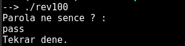
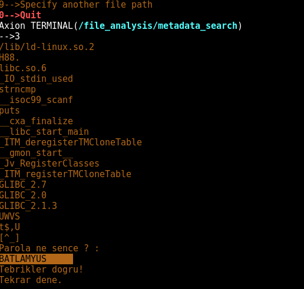
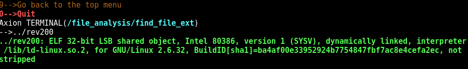
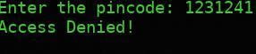
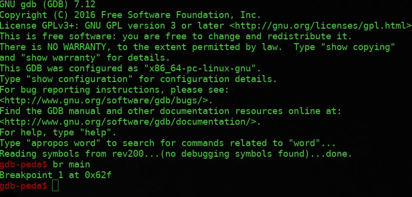
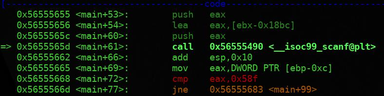
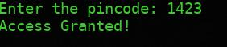

# AXION REHBER BOLUM 1

## Reverse Engineering Nedir?

### Giriş

Reverse Engineering (RE) , Türkçe'ye "Tersine Mühendislik" olarak çevirebileceğimiz,
yazılımsal ve donanımsal farklı teknolojilerin nasıl çalıştığının keşfedilmesi işlemidir.

Yine günümüzde bilgisayar yazılımları ve oyunlar da Reverse Engineering
araçlarıyla kırılmaktadır.

Normal şartlarda örneğin C, C++ gibi programlama dilleriyle yazılan yazılımlar,
Disassembler denilen ve kodu makine dili olan Assembler'a çeviren araçlar ile kırılmaktadır.
Bu işleme Reverse Code Engineering (RCE) denmektedir.

### CTF'ler ile alakası ne?

CTF'lerde önemli bir alt soru grubu olarak karşımıza çıkan Rev sorularını çözmek
için genelde özel araçlar kullanılarak derlenmiş kodu
derlenmemiş hale getirmek gerekir. Böylece içlerine gizlenmiş Flag'lere
ulaşabiliriz.

### Faydalı Linkler ve Kaynaklar

* [IDA pro](https://www.hex-rays.com/products/ida/) - En çok kullanılan ve bir çok özellik barındıran *Disassembler*
* [GDB](https://www.gnu.org/software/gdb/) - GNU Debugger
* [PEDA](https://github.com/longld/peda) - GDB eklentisi. GDB'ye yeni özellikler getiriyor.
* [LiveOverflow](http://liveoverflow.com/binary_hacking/reverse_engineering.html) - Reverse Engineering eğitim serisi (İngilizce)

## Örnek Soru Çözümleri

Reverse Engineering soruları çeşit bakımından çok fazla ama burda bir iki örnek
yardımıyla anlatmaya çalışacağız.

### CanYouPwnME CTF REV100

Dosyanın çalıştırılabilir olduğunu gördükten sonra çalıştırmak için önce

```bash
chmod +x rev100
```

komutu ile çalıştırma izni veriyor ardından çalıştırıyoruz.



Bizden parola bilgisi istiyor. *Axion'u* kullanarak *Metadata'sını* görüntülüyoruz ve *strings* çıktısına bakıyoruz.



FLAG = **BATLAMYUS**

### CanYouPwnME CTF REV200

Axion ile dosyanın türüne bakıyoruz,



Sonrasında çalıştırıp baktığımızda program bizden bir girdi bekliyor ve doğruluğuna göre sonuç veriyor.



Programımızı şuana kadar yüzeysel olarak analiz ettik ve elimizde şunlar var; program bizden bir pincode istiyor ve bunu bir değerle karşılaştırıp doğruluğunu test ediyor. *GDB* kullanarak programın biraz daha derinlerine girelim. Programımızı gdb *rev200* komutu ile çalıştırıp main fonksiyonuna breakpoint koyduk.



Sonra *run* komutu ile çalıştırdık. Bizim programdan beklentimiz bizden girdi aldıktan sonra bir karşılaştırma yapmasıdır. Girdiyi alacağı kısımda *scanf* fonksiyonu çağırıyor olacak ve hemen sonrasında bizden aldığı girdiyi olması gereken değerle *cmp* ile karşılaştırıyor olacak. Çalıştırdıktan sonra *next* komutu kullanarak tek tek ilerliyoruz ve scanf fonksiyonun çağrıldığı kısıma geldik.



*Scanf’in* çağrılmasının ardından *cmp eax, 0x58f'in* geldiğini görmekteyiz. Burda bizden istediği değerin *0x58f* olduğunu bulduk, ancak bu *hexadecimal(16lık tabanda)* halinde, bunun *decimal(10luk tabanda)* halinde ki değeri bizi sonuca ulaştıracaktır  *0x58f -> 1423* .



FLAG = **1423**

Üsteki soruların çözümlerinde [buradan](https://www.aucyberclub.org/cozumler/2017/02/17/cypmctfcozumleri.html) yararlanılmıştır.


